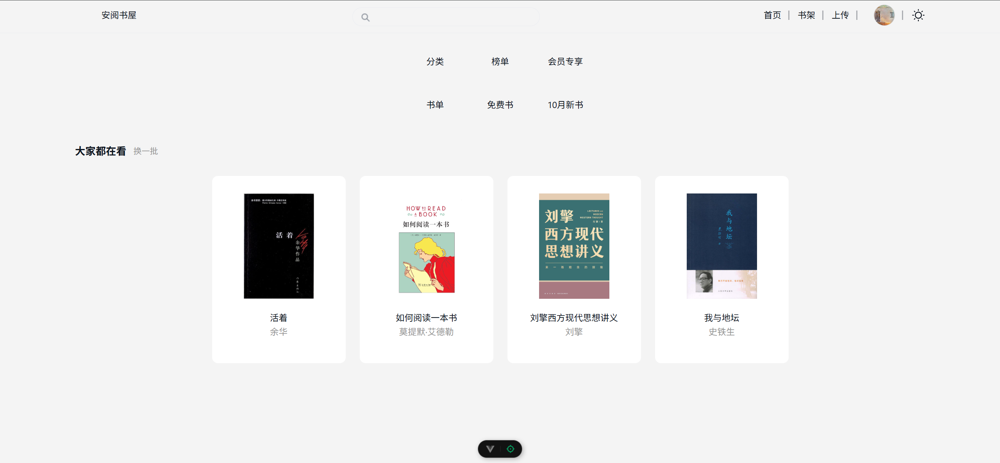
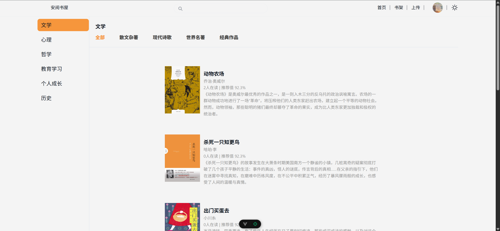
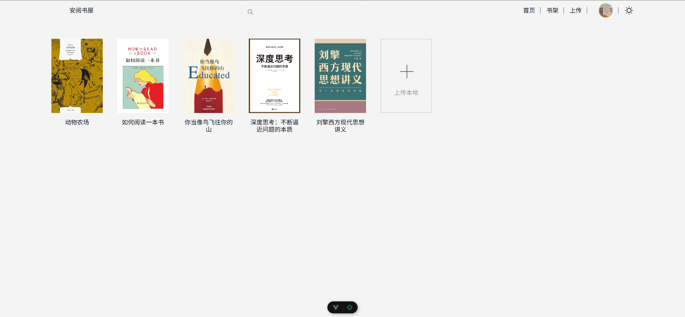
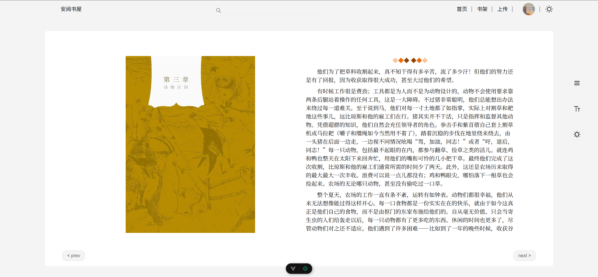
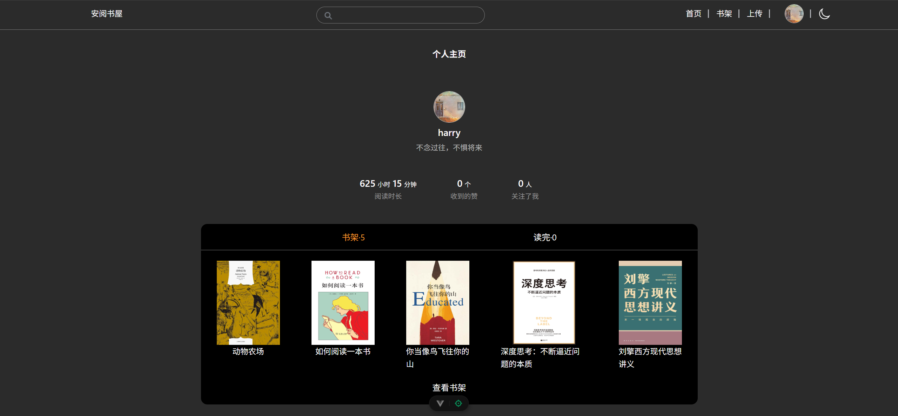

# anread-web

## Project Setup

```sh
npm install
```

### Compile and Hot-Reload for Development

```sh
npm run dev
```

### Compile and Minify for Production

```sh
npm run build
```

## Project Introduction

Technology Stack: SpringCloud+Vite+Vue3+Epubjs+Nacos+Gateway+OpenFeign+Mybatis-plus+MySql

For more, I didn't done that all thoroughly...

### ScreenShot











